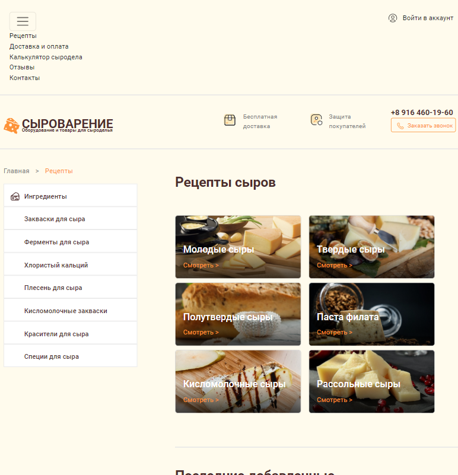

# Get Wash
Сайт для сокращения врмемени поиска автомоек и зарядных станций.
Одностраничник адаптируемый на разные разрешения экрана был преимущественно использован boostrap с модулем scss.
## Технологии


## Bootstrap
В headere был использован bootstrap, при уменьшении разрешения до 992px на экране выходит кнопка с навигацией.Так же на сайте присутсвует сайдбар.
``` html
        <div class="header__top">
            <div class="container">
                <nav class="navbar navbar-expand-lg header__nav d-inline-flex">
                    <div class="container-fluid">
                        <button class="navbar-toggler" type="button" data-bs-toggle="collapse"
                            data-bs-target="#navbarNavAltMarkup" aria-controls="navbarNavAltMarkup"
                            aria-expanded="false" aria-label="Toggle navigation">
                            <span class="navbar-toggler-icon"></span>
                        </button>
                        <div class="collapse navbar-collapse" id="navbarNavAltMarkup">
                            <div class="navbar-nav">
                                <a class="nav-link active nav__link" aria-current="page" href="#">Рецепты</a>
                                <a class="nav-link active nav__link" aria-current="page" href="#">Доставка и оплата</a>
                                <a class="nav-link active nav__link" aria-current="page" href="#">Калькулятор
                                    сыродела</a>
                                <a class="nav-link active nav__link" aria-current="page" href="#">Отзывы</a>
                                <a class="nav-link active nav__link" aria-current="page" href="#">Контакты</a>
                            </div>
                        </div>
                    </div>
                </nav>
                <a href="#" class="header__login text-nowrap float-end">Войти в аккаунт</a>
            </div>
        </div>


```



[Figma](https://www.figma.com/file/JNxErrWAN0YcgFYOoR1thY/SyroLavka?node-id=3%3A42)
